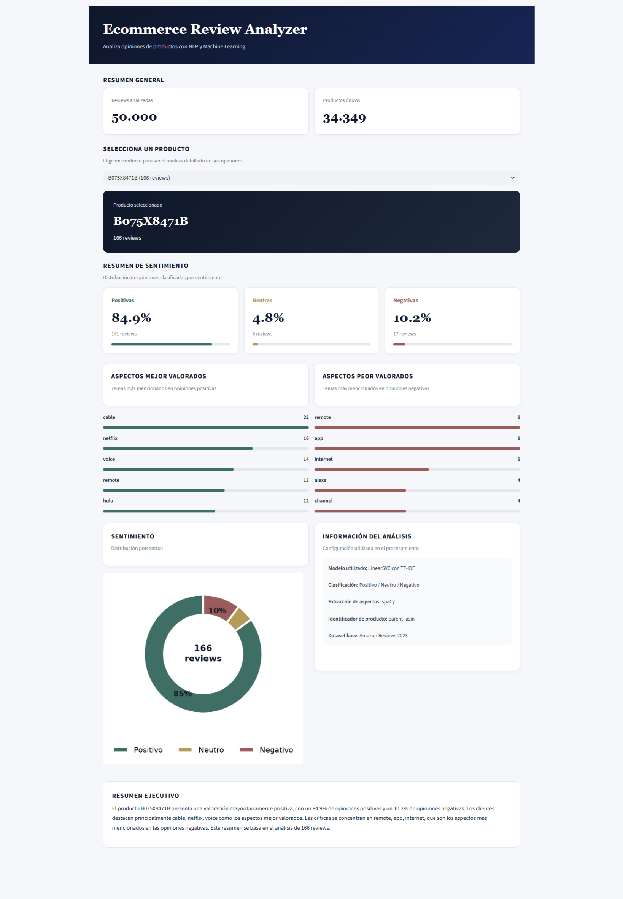

# Ecommerce Review Analyzer

An end-to-end Machine Learning project for analysing ecommerce product reviews using Natural Language Processing (NLP). The application automatically classifies customer sentiment and identifies the most relevant positive and negative product aspects through an interactive dashboard built with Streamlit.

---

## Dashboard



---

## Project Overview

Customer reviews contain valuable information for understanding user satisfaction and identifying product improvement opportunities.

This project combines Natural Language Processing (NLP) and Machine Learning to automatically analyse thousands of ecommerce reviews, classify their sentiment and extract the product features that customers mention most frequently.

The final result is an interactive dashboard where users can upload a dataset of reviews and obtain:

- Sentiment distribution
- Product-level analysis
- Executive summary
- Most valued product features
- Most criticised product features

---

## Dataset

The project uses a subset of the **Amazon Reviews 2023 Dataset**, a large-scale collection of product reviews published by **McAuley Lab (University of California, San Diego)**.

This dataset contains millions of Amazon product reviews collected across multiple product categories and is widely used for Natural Language Processing (NLP), recommendation systems and sentiment analysis research.

For this project, a subset of **50,000 reviews** was selected to facilitate exploratory analysis, model training and dashboard development.

**Original dataset:**

https://amazon-reviews-2023.github.io/

**Research paper:**

Hou, Y., Li, J., He, Z., Yan, A., Chen, X., & McAuley, J. (2024). *Bridging Language and Items for Retrieval and Recommendation*. arXiv.

The processed dataset used in this project contains approximately:

| Feature | Value |
|----------|--------|
| Reviews | 50,000 |
| Products | 34,000+ |
| Classes | Positive / Neutral / Negative |

---

**Official resources**

- Dataset website: https://amazon-reviews-2023.github.io/
- GitHub repository: https://github.com/McAuley-Lab/Amazon-Reviews-2023
- Authors: McAuley Lab – University of California, San Diego

## Machine Learning Pipeline

The project follows the complete Data Science workflow.

### 1. Exploratory Data Analysis

- Dataset inspection
- Missing values analysis
- Rating distribution
- Review length analysis
- Purchase verification analysis

---

### 2. Text Preprocessing

- Lowercase conversion
- HTML removal
- Punctuation removal
- Stopword removal
- Text normalization

---

### 3. Feature Engineering

Reviews are transformed into numerical vectors using:

- TF-IDF Vectorization
- Maximum vocabulary: 5,000 words

---

### 4. Machine Learning Models

Four different algorithms were evaluated.

| Model | Accuracy |
|--------|----------|
| Logistic Regression | 0.805 |
| Naive Bayes | 0.843 |
| Linear SVM | 0.856 |
| Random Forest | 0.867 |

Although Random Forest achieved the highest accuracy, **Linear SVM** was selected due to its better balance across the three sentiment classes.

---

### 5. Opinion Insights

After classifying the reviews, the application extracts the most frequent product aspects mentioned in:

- Positive reviews
- Negative reviews

Aspect extraction is performed using **spaCy**.

---

## Dashboard Features

The Streamlit application provides:

- Upload CSV files
- Automatic sentiment prediction
- Product filtering
- Sentiment distribution
- Executive summary generation
- Positive aspect extraction
- Negative aspect extraction

---

## Project Structure

```
project/

│

├── app/

│ └── app.py

│

├── data/

│ ├── raw/

│ └── processed/

│

├── models/

│ ├── modelo_sentimiento.pkl

│ └── vectorizador_tfidf.pkl

│

├── notebooks/

│ ├── 01_Carga_y_EDA.ipynb

│ ├── 02_Preprocesamiento.ipynb

│ ├── 03_Feature_Engineering.ipynb

│ ├── 04_Machine_Learning.ipynb

│ └── 05_Opinion_Insights.ipynb

│

├── requirements.txt

└── README.md
```

---

## Technologies

- Python
- pandas
- NumPy
- scikit-learn
- spaCy
- Streamlit
- Matplotlib

---

## Installation

Clone the repository

```bash
git clone https://github.com/hector-rod7/ecommerce-review-analysis-ml.git
```

Install dependencies

```bash
pip install -r requirements.txt
```

Run the application

```bash
streamlit run app/app.py
```

---

## Future Improvements

- Aspect-based sentiment analysis
- Transformer models (BERT)
- Interactive filtering by category
- Export reports to PDF
- Topic modelling
- Explainable AI

---

## Author

**Héctor Rodríguez**

Master in Data Science

Nod3r

GitHub:

https://github.com/hector-rod7